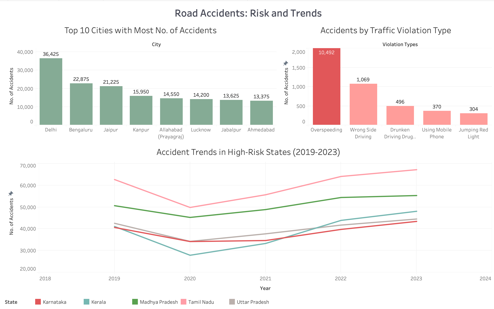
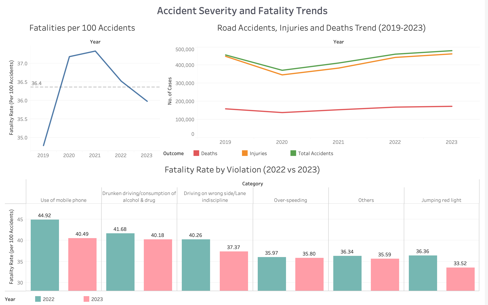

# Urban Traffic Risk Analysis (2019–2023)

This project analyzes road accident data from **2019 to 2023** to uncover patterns in accidents, fatality severity, and key risk factors across major Indian cities and states.
This aims to uncover trends, risk drivers, and high-impact insights that can support road safety decisions.

---

## Project Objectives

- Analyze **road accident trends** across years (2019–2023)
- Identify **high-risk traffic violations**
- Identify **high-risk cities and states** based on accident volumes
- Compare **severity and fatality rates** across violation categories
- Present insights through **interactive Tableau dashboards**

---

## Tech Stack

- **Python:** Pandas, Matplotlib, Seaborn
- **SQL:** MySQL
- **Visualization:** Tableau

---

## Data Preparation 

Key preprocessing steps:

- Converted numeric fields stored as strings (with commas) into integers
- Removed unwanted aggregate rows (`Total`, `All India`, invalid symbols)
- Reshaped state-level data from **wide to long format**
- Standardized column naming for analysis consistency
- Engineered **fatality_rate** as a primary severity metric
- Created clean datasets for Tableau and SQL

---

## Exploratory Analysis (Python) 

- **Accidents vs Fatalities:** 
  Accident volumes fluctuated year-to-year, but fatality rates did not always move proportionally, indicating that severity varies independently of accident count.
- **COVID Impact:**
  Accident counts dropped sharply during COVID years, but fatality rates increased, suggesting higher accident severity despite lower traffic volume.
- **Violation Severity Patterns:**
  Some traffic violations show lower frequency but disproportionately high fatality rates, highlighting hidden high-risk behaviors.
- **Urban Concentration:**
  A small number of major cities account for a large share of total fatalities, indicating concentrated urban risk rather than uniform distribution.

--- 

## SQL Analytical Insights (MySQL)

- Ranking years by accident count and fatality severity
- Identifying high-risk traffic violations using frequency vs severity logic
- City-level and state-level contribution to national fatalities
- Year-over-year changes in fatality rates by violation category
- Pre-COVID vs COVID vs post-COVID accident comparisons
- State-wise accident growth and national share analysis
- Ranked dangerous years and violations

---

## Tableau Dashboards

### 1️⃣ Road Accidents: Risk and Trends

### 2️⃣ Accident Severity and Fatality Trends

---

## Key Insights 

- Covid year (2020) saw **lower accidents but higher fatality rate**
- **Overspeeding** is the leading contributor to road accidents across cities
- 2023 recorded the **highest number of accidents**
- **Mobile phone usage** while driving shows a high accident occurrence rate 
- **Drunken driving** exhibits low frequency but extremely high severity
- Several states show **year-over-year growth in accidents**, indicating worsening road safety
- **Post-Covid traffic behavior is more dangerous than pre-Covid**
- Certain cities consistently rank high across years, pointing to **structural urban traffic issues**

